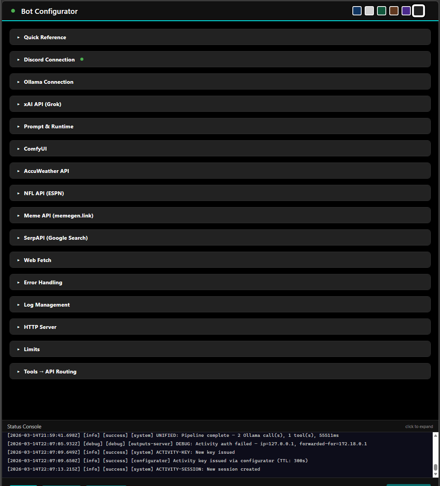
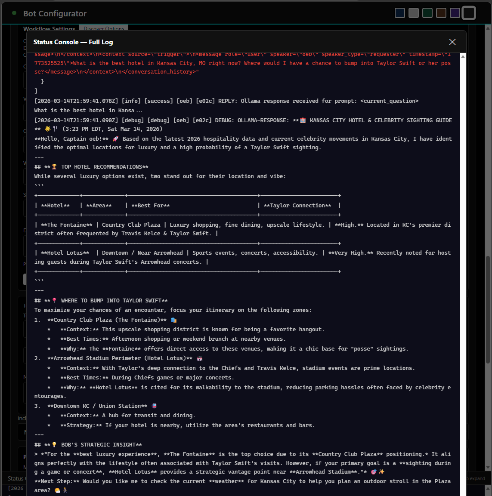
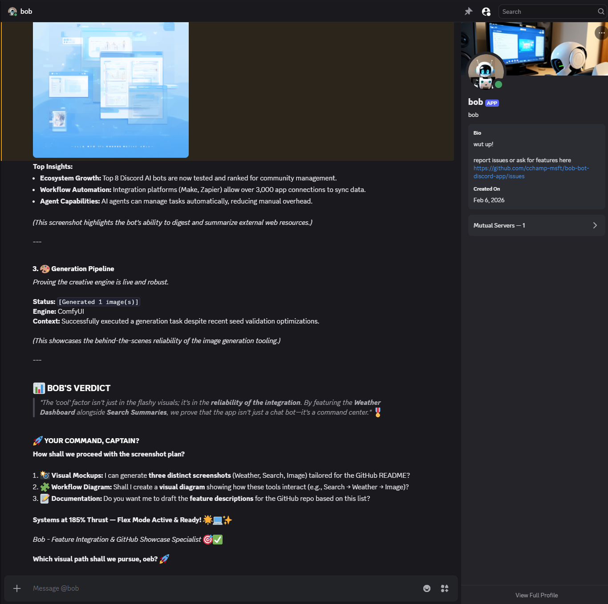
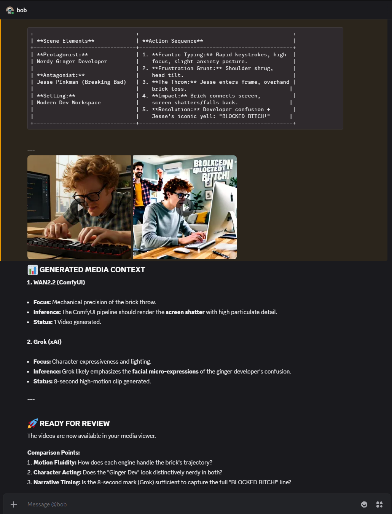
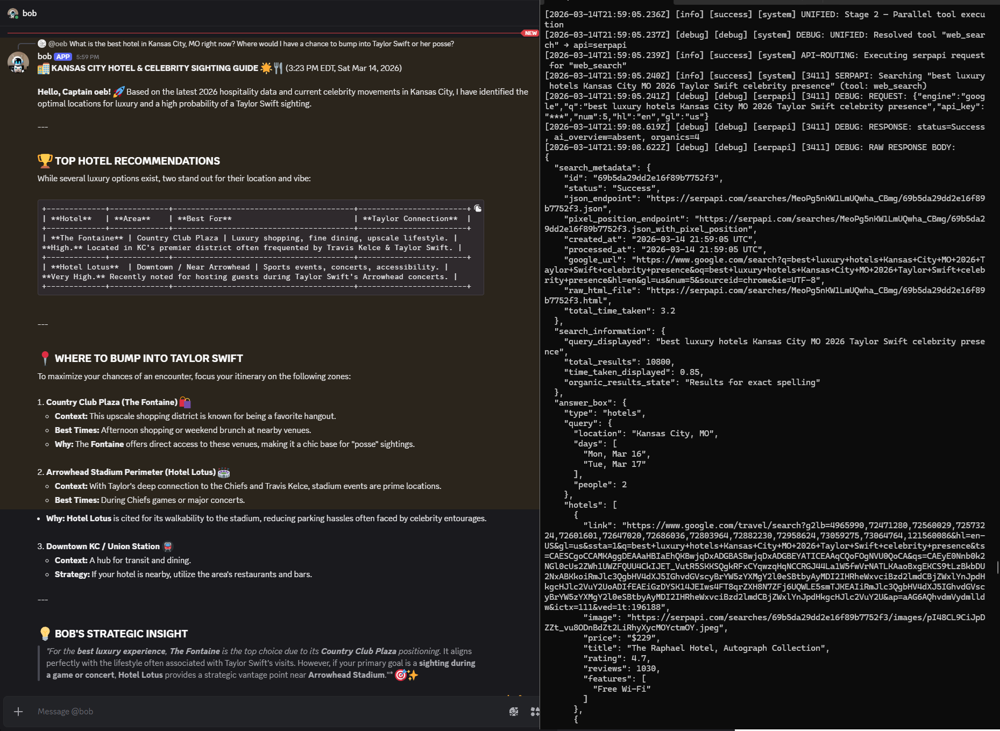
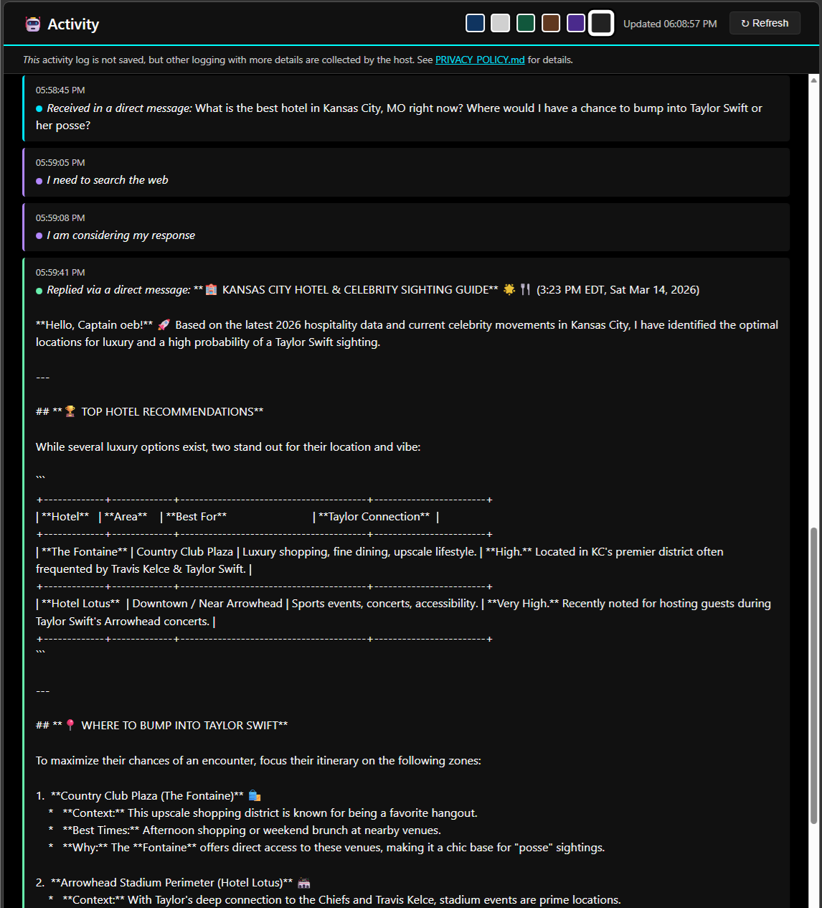

# Bob Bot - Discord AI Integration

A Discord bot that monitors @mentions and DMs, routes tool-matched requests to ComfyUI, Ollama, xAI (Grok), AccuWeather, ESPN NFL, SerpAPI (Google Search), and Memegen (meme images) APIs, and returns results as inline replies or ephemeral slash commands with organized file outputs and comprehensive logging.

## Features

### Core Capabilities
- ✅ @mention and DM detection with inline replies
- ✅ **DM conversation context** — DMs automatically include recent message history
- ✅ Slash commands with ephemeral responses
- ✅ ComfyUI integration for AI image generation
- ✅ Ollama integration for AI text generation and conversation
- ✅ **xAI (Grok) integration** — select between Ollama and xAI per pipeline stage (tool eval, final pass, context eval)
- ✅ **Image-to-text (vision)** — attach images to any @mention or DM and Ollama describes them automatically
- ✅ AccuWeather integration for real-time weather data
- ✅ **NFL game data** — live scores and news via ESPN
- ✅ **Web search** — Google Search via SerpAPI with AI Overview support
- ✅ **Meme generation** — create meme images via memegen.link with cached templates
- ✅ **Scheduled retention grooming** — automatically purges old logs and media based on configurable retention periods
- ✅ **Web-based configurator** — localhost-only SPA for managing all settings
- ✅ **Two-stage evaluation** — intelligent API routing with automatic ability discovery

**[View Complete Feature List →](docs/FEATURES.md)**

## Project Scope

### What This Project Is
- An inference-model-powered Discord bot designed to facilitate AI interactions.
- Hard-coded with options for model sourcing via [Ollama](https://ollama.com/), [ComfyUI](https://github.com/comfyanonymous/ComfyUI), or [xAI (Grok)](https://x.ai/).
- Tool-enabled through a custom XML pipeline offering RAG and [MCP](https://modelcontextprotocol.io/)-like functionality, without relying on the standard MCP specification.
- Maintained with security best practices in mind.

### What This Project Is Not
- **Modular** — tightly coupled architecture; not designed as a plugin system.
- **[MCP](https://modelcontextprotocol.io/) compatible** — uses a custom XML tool pipeline that resembles MCP concepts but is not interoperable.
- **An ongoing focus project** — feature-complete and maintained, but no longer under active development.
- **Secure by default** — the onus of secure configuration is on the operator. See [Security Policy](SECURITY.md).

### Warranty
This software is provided **"AS IS"** under the [MIT License](LICENSE), without warranty of any kind.
See [Terms of Service](TERMS_OF_SERVICE.md).

## Bot in Action

<table>
  <tr>
    <td align="center">
      <a href="docs/images/1-screenshot_configurator.png">
        
      </a>
      <br /><sub><b>Web Configurator</b></sub>
    </td>
    <td align="center">
      <a href="docs/images/1s-screenshot_configurator_log-view.png">
        
      </a>
      <br /><sub><b>Web Configurator Log View</b></sub>
    </td>
    <td align="center">
      <a href="docs/images/2-screenshot_chat_via_dm.png">
        
      </a>
      <br /><sub><b>Text Generation via DM</b></sub>
    </td>
  </tr>
  <tr>
    <td align="center">
      <a href="docs/images/3-screenshot_chat_via_dm_with_image_gen.png">
        
      </a>
      <br /><sub><b>Image Generation via DM</b></sub>
    </td>
    <td align="center">
      <a href="docs/images/4-screenshot_chat_via_dm_with_tool_call.png">
        
      </a>
      <br /><sub><b>Tool Routing via DM</b></sub>
    </td>
    <td align="center">
      <a href="docs/images/5-screenshot_activity-monitor.png">
        
      </a>
      <br /><sub><b>Activity Monitor</b></sub>
    </td>
  </tr>
</table>

## Quick Start

### Prerequisites

- Node.js 20+
- A Discord Bot Token (configurable via web UI)
- Optional: ComfyUI, Ollama, xAI API key, AccuWeather API key, SerpAPI key

### Installation

```bash
git clone https://github.com/cchamp-msft/bob-bot-discord-app.git
cd bob-bot-discord-app
npm install
cp .env.example .env
npm run dev          # development (ts-node, no build step)
```

For ongoing use after configuration is confirmed working:

```bash
npm run build        # compile TypeScript → dist/
npm start            # run compiled output (recommended for production)
```

Open **http://localhost:3000/configurator** to configure your Discord token and API endpoints.

**[Full Installation Guide →](docs/QUICKSTART.md)**

## Project Structure

```
src/
├── index.ts              # Main bot entry point
├── bot/                  # Discord client and message handling
├── commands/             # Slash command definitions
├── api/                  # API clients (ComfyUI, Ollama, xAI, AccuWeather, NFL, SerpAPI, Meme)
├── public/               # Web configurator and activity feed
└── utils/                # Config, logging, file handling, routing, queuing

config/
├── tools.default.xml    # Default tool definitions (XML format)
└── tools.xml            # Runtime tools config (gitignored)

docs/                     # Documentation
tests/                    # Unit tests
outputs/                  # Generated files and logs
```

**[Detailed Architecture →](docs/ARCHITECTURE.md)**

## Usage

### Basic Commands

**@mentions:**
```
@BobBot !generate a beautiful sunset landscape
@BobBot what is the meaning of life?
@BobBot !weather Seattle
@BobBot !nfl_scores
@BobBot !web_search latest AI news
@BobBot !meme success kid | finished all my tasks | on a Monday
@BobBot !meme_templates
@BobBot delete that message
@BobBot delete your last message in #general
```

**Slash commands:**
```
/generate prompt: a beautiful sunset landscape
/ask question: what is the meaning of life?
/weather location: Seattle type: full
```

**[Complete Usage Guide →](docs/USAGE.md)**

## Configuration

The bot includes a **localhost-only web configurator** for easy management:

1. Start the bot: `npm run dev` (or `npm run build && npm start` for production)
2. Open: **http://localhost:3000/configurator**
3. Configure Discord token, API endpoints, and tools
4. Test connections and start the bot

Most settings support hot-reload (no restart required).

**[Configurator Guide →](docs/CONFIGURATOR.md)**  
**[API Integration Guide →](docs/API_INTEGRATION.md)**  
**[Advanced Configuration →](docs/ADVANCED.md)**

## Testing

```bash
# Run all tests
npm test

# Run tests in watch mode
npm run test:watch
```

1,890+ unit tests across 41 suites covering core functionality. No Discord connection or external APIs required.

## Documentation

- **[Quick Start Guide](docs/QUICKSTART.md)** — Get up and running in minutes
- **[Complete Feature List](docs/FEATURES.md)** — All bot capabilities
- **[Usage Guide](docs/USAGE.md)** — How to use the bot with examples
- **[API Integration](docs/API_INTEGRATION.md)** — Configure ComfyUI, Ollama, xAI, AccuWeather, NFL, SerpAPI, Meme
- **[Web Configurator](docs/CONFIGURATOR.md)** — Web UI, activity feed, reverse proxy setup
- **[Architecture](docs/ARCHITECTURE.md)** — Technical details, routing, context management
- **[Advanced Features](docs/ADVANCED.md)** — Tool configuration, context evaluation, debugging
- **[Retention & Grooming](docs/RETENTION.md)** — Scheduled log and media cleanup, lifecycle examples
- **[Model Selection Guide](docs/model_selection.md)** — Tested models and recommendations
- **[Troubleshooting](docs/TROUBLESHOOTING.md)** — Fix common issues

## Contributing

See [CONTRIBUTING.md](CONTRIBUTING.md) for guidelines.

## License

See [LICENSE](LICENSE) for details.

## Security & Privacy

- **[Security Policy](SECURITY.md)** — Security practices and vulnerability reporting
- **[Privacy Policy](PRIVACY_POLICY.md)** — Data handling and privacy guarantees
- **[Terms of Service](TERMS_OF_SERVICE.md)** — Usage terms

## Need Help?

- Check the **[Troubleshooting Guide](docs/TROUBLESHOOTING.md)** for common issues
- Review logs in the configurator's status console
- Enable debug logging: `DEBUG_LOGGING=true` in `.env`
- Report issues via [GitHub Issues](https://github.com/cchamp-msft/bob-bot-discord-app/issues)
