# Message & API Routing Flow

This document illustrates the complete message and API routing flow in bob-bot-discord-app, using the **`@BobBot !weather Seattle`** prompt as a concrete example. This keyword touches an ability and routes through AccuWeather using the shared API path.

---

## Flow Chart

```mermaid
flowchart TD
    subgraph Discord["Discord (External)"]
        A["👤 User sends:<br/><code>@BobBot !weather Seattle</code>"]
    end

    subgraph DiscordManager["discordManager.ts — Event Listener"]
        B["client.on('messageCreate')<br/>→ messageHandler.handleMessage(message)"]
    end

    subgraph MessageHandler["messageHandler.ts — handleMessage()"]
        C["Strip @mention → content = <b>'!weather Seattle'</b>"]
        D["Collect conversation history<br/><code>collectReplyChain()</code> or <code>collectDmHistory()</code>"]
        E{"<b>findKeyword(content)</b><br/>Regex match at start of message?<br/><i>sorted longest-first</i>"}

        E1["✅ Match: <b>'!weather'</b><br/><code>api: 'accuweather'</code>"]
        E2["❌ No regex match<br/><i>(would enter two-stage path)</i>"]

        F{"<code>apiKeywordMatched?</code><br/>keywordConfig.api !== 'ollama'?"}
        G["✅ Yes — <b>Direct API routing path</b>"]
        H["❌ No — <b>Two-stage evaluation path</b><br/><code>executeWithTwoStageEvaluation()</code>"]

        I["Strip keyword from content<br/><code>stripKeyword()</code><br/>content = <b>'Seattle'</b>"]
        J["Reply: ⏳ Processing your request..."]
    end

    subgraph APIRouter["apiRouter.ts — executeRoutedRequest()"]
        K["Receive: keywordConfig, content, requester, history"]
        L["Check: <code>needsFinalPass = keywordConfig.finalOllamaPass</code><br/>→ <b>false</b> (default weather route)"]

        subgraph PrimaryAPI["Stage 1: Primary API Request"]
            M["<code>requestQueue.execute('accuweather', ...)</code>"]
            N["<code>apiManager.executeRequest('accuweather', ...)</code><br/>mode = full"]
            O["AccuWeather API call<br/>→ Returns weather data for Seattle"]
            P["<code>extractStageResult('accuweather', result)</code><br/>→ <code>stages.push(primaryExtracted)</code>"]
        end

        Q{"Primary API success?"}
        Q1a{"Retry enabled?"}
        Q1b["🔄 Ollama refines params<br/><code>buildRetryUserPrompt()</code>"]
        Q1c["❌ Return error RoutedResult"]
        Q2["✅ Success — check finalOllamaPass"]

        R{"<code>needsFinalPass && api !== 'ollama'?</code>"}
        R1["Skip — primary was already Ollama"]

        subgraph FinalPass["Stage 2: Final Ollama Refinement Pass"]
            S["<code>evaluateContextWindow()</code><br/>Filter conversation history for relevance"]
            T["Build <code>&lt;external_data&gt;</code> block:<br/><code>formatAccuWeatherExternalData(location, data)</code><br/>→ <code>&lt;accuweather_data source='weather' location='Seattle'&gt;</code>"]
            U["<code>assembleReprompt()</code><br/>System: persona only <i>(NO abilities/keyword rules)</i><br/>User: <code>&lt;conversation_history&gt;</code> + <code>&lt;external_data&gt;</code> + <code>&lt;current_question&gt;</code>"]
            V["<code>requestQueue.execute('ollama', ...)</code><br/>→ <code>apiManager.executeRequest('ollama', ...)</code><br/>model = OLLAMA_FINAL_PASS_MODEL or default"]
            W["(Optional) Ollama final-pass refinement<br/>when enabled on a keyword"]
        end

        X["Return <b>RoutedResult</b><br/><code>{ finalResponse, finalApi: 'ollama', stages }</code>"]
    end

    subgraph Dispatch["messageHandler.ts — dispatchResponse()"]
        Y{"Switch on <code>finalApi</code>"}
        Y1["<code>handleComfyUIResponse()</code>"]
        Y2["<code>handleOllamaResponse()</code> ✅ <i>(our path)</i>"]
        Y3["<code>handleAccuWeatherResponse()</code>"]
        Y4["<code>handleNFLResponse()</code>"]
        Y5["<code>handleSerpApiResponse()</code>"]
        Y6["<code>handleMemeResponse()</code>"]
    end

    subgraph Response["messageHandler.ts — handleOllamaResponse()"]
        Z["<code>chunkText(text)</code><br/>Split into Discord-safe chunks"]
        Z1["<code>processingMessage.edit(chunks[0])</code><br/>Replace ⏳ with first chunk"]
        Z2["<code>channel.send(chunks[i])</code><br/>Send overflow chunks as follow-ups"]
        Z3["<code>logger.logReply()</code>"]
    end

    subgraph TwoStage["messageHandler.ts — executeWithTwoStageEvaluation()<br/><i>(alternate path — shown for completeness)</i>"]
        TS1["<code>evaluateContextWindow()</code> — filter history<br/><i>(only when contextFilterEnabled)</i>"]
        TS2["<code>assemblePrompt()</code><br/>System: persona + abilities + keyword rules<br/>User: XML-tagged prompt with <code>&lt;thinking_and_output_rules&gt;</code>"]
        TS3["<code>requestQueue.execute('ollama', ...)</code><br/>Ollama responds with abilities awareness"]
        TS4{"<code>parseFirstLineKeyword()</code><br/>First line = exact keyword?"}
        TS5["✅ Keyword found"]
        TS5a{"Required params<br/>missing?"}
        TS5b["<code>inferAbilityParameters()</code><br/>Ollama extracts params from natural language"]
        TS5c["<code>executeRoutedRequest()</code><br/><i>(forced finalOllamaPass = true)</i>"]
        TS9["❌ No keyword → return Ollama response as direct chat"]
    end

    A --> B --> C --> D --> E
    E -->|"'!weather' matches regex"| E1
    E -->|"e.g. 'is it going to rain?'"| E2
    E1 --> F
    F -->|"accuweather ≠ ollama"| G
    F -->|"api = ollama or no match"| H
    G --> I --> J --> K
    K --> L --> M --> N --> O --> P --> Q
    Q -->|"fail"| Q1a
    Q1a -->|"yes"| Q1b --> M
    Q1a -->|"no"| Q1c
    Q -->|"success"| Q2 --> R
    R -->|"true ✅"| S --> T --> U --> V --> W --> X
    R -->|"primary was ollama"| R1
    X --> Y
    Y -->|"comfyui"| Y1
    Y -->|"ollama"| Y2
    Y -->|"accuweather"| Y3
    Y -->|"nfl"| Y4
    Y -->|"serpapi"| Y5
    Y -->|"meme"| Y6
    Y2 --> Z --> Z1 --> Z2 --> Z3

    H --> TS1 --> TS2 --> TS3 --> TS4
    TS4 -->|"yes"| TS5 --> TS5a
    TS5a -->|"yes"| TS5b --> TS5c
    TS5a -->|"no"| TS5c
    TS4 -->|"no"| TS9

    E2 --> H

    style A fill:#5865F2,color:#fff
    style E fill:#f9a825,color:#000
    style F fill:#f9a825,color:#000
    style Q fill:#f9a825,color:#000
    style R fill:#f9a825,color:#000
    style TS4 fill:#f9a825,color:#000
    style TS5a fill:#f9a825,color:#000
    style Q1a fill:#f9a825,color:#000
    style E1 fill:#4caf50,color:#fff
    style G fill:#4caf50,color:#fff
    style W fill:#4caf50,color:#fff
    style X fill:#4caf50,color:#fff
    style Z3 fill:#4caf50,color:#fff
    style Q1c fill:#f44336,color:#fff
    style Discord fill:#5865F222
    style DiscordManager fill:#7289DA22
    style MessageHandler fill:#43b58122
    style APIRouter fill:#ff980022
    style PrimaryAPI fill:#2196F322
    style FinalPass fill:#9c27b022
    style Dispatch fill:#60768822
    style Response fill:#00968822
    style TwoStage fill:#78909c22
```

---

## Walkthrough: `@BobBot !weather Seattle`

### 1. Discord Event → MessageHandler
**File:** `discordManager.ts` → `messageHandler.ts`

The Discord.js `messageCreate` event fires and calls `messageHandler.handleMessage(message)`.

### 2. Content Extraction & Keyword Matching
**File:** `messageHandler.ts`

- The `@mention` is stripped → `content = "!weather Seattle"`
- `findKeyword()` matches **`"!weather"`** at the start of the message
- `keywordConfig` = `{ keyword: '!weather', api: 'accuweather', timeout: 60 }`
- Since `api !== 'ollama'` → `apiKeywordMatched = true` → takes the **direct API routing path**

### 3. API Router — Primary Request
**File:** `apiRouter.ts`

`executeRoutedRequest()` executes the AccuWeather API via the request queue:
- `requestQueue.execute('accuweather', ...)` → `apiManager.executeRequest('accuweather', ...)`
- AccuWeather returns raw weather data for Seattle
- `extractStageResult()` normalizes the response and pushes it to the `stages` array
- If the primary request fails and retry is enabled, Ollama refines the parameters and the API is re-attempted (up to `maxRetries` times)

### 4. API Router — Final Ollama Pass
**Files:** `apiRouter.ts` + `promptBuilder.ts`

Since `finalOllamaPass: true` and the primary API was `accuweather` (not `ollama`), the result flows into a second stage:

- **`evaluateContextWindow()`** — filters conversation history for relevance
- **`formatAccuWeatherExternalData()`** — wraps weather data in `<accuweather_data>` XML tags
- **`assembleReprompt()`** — builds the final prompt with:
  - **System**: persona only (NO abilities/keyword rules — prevents infinite loops)
  - **User**: `<conversation_history>` + `<external_data>` + `<current_question>`
- If `finalOllamaPass` is enabled on a keyword, Ollama can refine the API result conversationally

### 5. Response Dispatch
**File:** `messageHandler.ts`

The `RoutedResult` returns with `finalApi: 'ollama'`, so `dispatchResponse()` routes to `handleOllamaResponse()`.

### 6. Discord Reply
**File:** `messageHandler.ts`

The `⏳ Processing...` message is edited in-place with the final weather response, chunked if necessary for Discord's message limits.

---

## Key Functions by File

| File | Function | Role |
|------|----------|------|
| `discordManager.ts` | `client.on('messageCreate')` | Entry point — Discord event listener |
| `messageHandler.ts` | `handleMessage()` | Orchestrator — routing decision |
| `messageHandler.ts` | `findKeyword()` | Regex keyword matching (longest-first) |
| `messageHandler.ts` | `executeWithTwoStageEvaluation()` | Fallback path when no keyword matches |
| `messageHandler.ts` | `dispatchResponse()` | Routes final result to correct handler |
| `apiRouter.ts` | `executeRoutedRequest()` | Executes primary API + optional final pass |
| `promptBuilder.ts` | `assemblePrompt()` | Builds XML prompt WITH abilities context |
| `promptBuilder.ts` | `assembleReprompt()` | Builds XML prompt WITHOUT abilities (final pass) |
| `promptBuilder.ts` | `parseFirstLineKeyword()` | Parses Ollama output for keyword trigger |
| `apiRouter.ts` | `inferAbilityParameters()` | Extracts API params from natural language (two-stage path) |
| `keywordClassifier.ts` | `buildAbilitiesContext()` | Generates abilities context for Ollama |
| `contextEvaluator.ts` | `evaluateContextWindow()` | Filters conversation history for relevance (per-keyword opt-in via `contextFilterEnabled`) |
| `responseTransformer.ts` | `extractStageResult()` | Normalizes API responses for stage tracking |

---

## Example Flows (Summary)

| Scenario | Path |
|----------|------|
| **`!weather Seattle`** | Regex match → AccuWeather API → Discord reply |
| **`!generate a sunset`** | Regex match → ComfyUI API → Discord reply (images) |
| **`!weather 45403`** | Regex match → AccuWeather API → Discord reply (raw data) |
| **`is it going to rain?`** | No regex match → Two-stage: Ollama w/ abilities → keyword detected → AccuWeather → Final pass → Discord reply |
| **`tell me a joke`** | No regex match → Two-stage: Ollama w/ abilities → no keyword → Ollama response returned directly |
| **`!nfl scores`** | Regex match → NFL API → Final Ollama pass → Discord reply |
| **`!search latest news`** | Regex match → SerpAPI → Final Ollama pass → Discord reply |
| **`!meme surprised pikachu`** | Regex match → Meme API → Discord reply (image) |