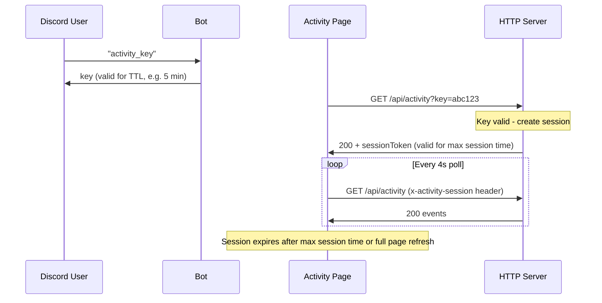

# Activity Monitor Improvements

## Item 1: Decouple Session Lifetime from Key TTL

### Problem

Currently, every `/api/activity` poll re-validates the activity key against its TTL (default 300s). Once the key expires, the user is locked out and must request a new key from Discord. The key TTL serves double duty as both the initial authentication window *and* the session duration, which is unnecessarily disruptive for long monitoring sessions.

### Design

Introduce a **server-side session** concept: once a key is successfully validated for the first time, the server issues a **session token** with a longer lifetime. Subsequent polls use the session token instead of the raw key.

**Key behaviors:**

- Activity keys still rotate and expire per the existing `ACTIVITY_KEY_TTL` (used only for initial authentication)
- Once authenticated, the server creates a session (random token + creation timestamp)
- The session token is stored in `sessionStorage` on the client (cleared on tab close / full refresh)
- Sessions expire after `ACTIVITY_SESSION_MAX_TIME` (default 86400 seconds = 1 day)
- New keys can still be issued and used for fresh authentications; existing sessions remain valid
- Only one active session at a time (issuing a new session replaces the old one, same as keys today)

### Files to Change

**[src/utils/activityKeyManager.ts](src/utils/activityKeyManager.ts)** -- Add session management alongside existing key management:

- Add `ActiveSession` interface (`{ token: string, createdAt: number }`)
- Add `createSession(): string` -- generates a session token when a key is first validated
- Add `isSessionValid(token: string): boolean` -- validates session token against max session time
- Add `revokeSession(): void` for testing

**[src/utils/config.ts](src/utils/config.ts)** -- Add new setting:

- `getActivitySessionMaxTime(): number` -- reads `ACTIVITY_SESSION_MAX_TIME` env var, default `86400` (1 day)

**[src/utils/outputsServer.ts](src/utils/outputsServer.ts)** -- Update `/api/activity` route:

- Check for session token first (via `x-activity-session` header or `session` query param)
- If valid session: serve events as usual
- If no session but valid key: create session, return events + `sessionToken` in response JSON
- If neither: 401

**[src/public/activity.html](src/public/activity.html)** -- Update client-side auth:

- Store session token in `sessionStorage` (separate key from `activityKey`)
- On successful key submission: extract `sessionToken` from response, store it
- On subsequent polls: send session token via `x-activity-session` header
- On 401: clear both stored key and session, show prompt
- Update the key-expired message to reflect new behavior (no longer need to re-request key every 5 min)

**[src/bot/messageHandler.ts](src/bot/messageHandler.ts)** -- Update the activity_key reply message (lines 195-203):

- Adjust wording: key is for initial authentication only; session persists until page refresh or max session time

**[tests/activityKeyManager.test.ts](tests/activityKeyManager.test.ts)** -- Add session tests:

- Session creation after valid key
- Session validation
- Session expiry after max time
- Session revocation

**[tests/outputsServer.test.ts](tests/outputsServer.test.ts)** -- Add session-based auth tests

---

## Item 2: Replace "Replied via ollama" with DM/Channel Context

### Problem

The `emitBotReply` method currently shows "Replied via ollama" (or whichever API), but this isn't meaningful to the activity monitor viewer. Instead, it should say "Replied via direct message" or "Replied via channel message".

### Design

Thread the `isDM` boolean from `handleMessage` down through `dispatchResponse` and each `handle*Response` method, then pass it to `emitBotReply`. Update `emitBotReply` to accept a location parameter and use it in the narrative.

### Files to Change

**[src/utils/activityEvents.ts](src/utils/activityEvents.ts)** -- Update `emitBotReply` signature (line 212):

- Change: `emitBotReply(api: string, responseText: string)` 
- To: `emitBotReply(api: string, responseText: string, isDM: boolean)`
- Update narrative from `Replied via ${api}` to `Replied via ${isDM ? 'direct message' : 'channel message'}`
- Keep `api` in the metadata so no information is lost

**[src/bot/messageHandler.ts](src/bot/messageHandler.ts)** -- Thread `isDM` through the call chain:

- `dispatchResponse` (line 912): add `isDM: boolean` parameter
- `handleOllamaResponse` (line 1108): add `isDM: boolean` parameter, pass to `emitBotReply`
- `handleAccuWeatherResponse` (line 1137): same
- `handleNFLResponse` (line 1166): same
- `handleSerpApiResponse` (line 1198): same
- `handleComfyUIResponse`: add `isDM` parameter for consistency (image reply narrative can optionally be updated too)
- Update all call sites of `dispatchResponse` (~5 locations around lines 286, 845, 867, 893, 905) to pass `isDM`
- `isDM` is already available in `handleMessage` (line 52) and can be passed to `executeWithTwoStageEvaluation` (line 294) and then to `dispatchResponse`

**[tests/activityKeyManager.test.ts](tests/activityKeyManager.test.ts)** / any activity events tests -- Update `emitBotReply` calls to include the new parameter