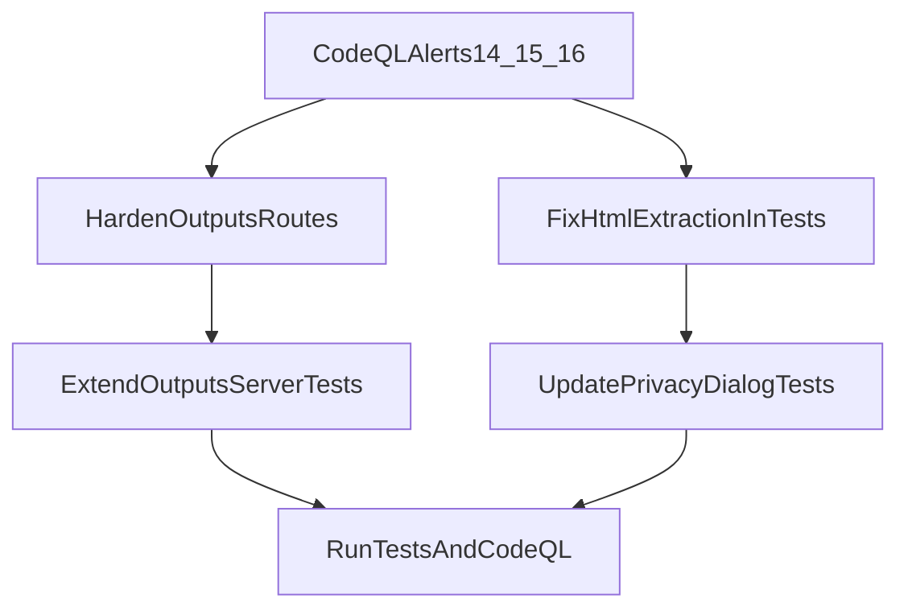

# Address GitHub Code Scanning Findings

## Findings To Fix

- Alert `#14` (`js/missing-rate-limiting`) in `[src/utils/outputsServer.ts](src/utils/outputsServer.ts)`: `/api/privacy-policy` reads from filesystem without request throttling.
- Alert `#15` (`js/missing-rate-limiting`) in `[src/utils/outputsServer.ts](src/utils/outputsServer.ts)`: `/activity` serves a file without request throttling.
- Alert `#16` (`js/bad-tag-filter`) in `[tests/activityPrivacyDialog.test.ts](tests/activityPrivacyDialog.test.ts)`: `<script>` extraction uses a case-sensitive regex that can miss uppercase tags.

## Implementation Steps

1. Add lightweight in-memory rate limiting middleware in `[src/utils/outputsServer.ts](src/utils/outputsServer.ts)` and apply it specifically to `GET /activity` and `GET /api/privacy-policy`.
  - Key by client IP (with existing `trust proxy=false` behavior) and enforce a small windowed max request count.
  - Return `429` JSON with retry guidance when exceeded.
2. Add configuration getters in `[src/utils/config.ts](src/utils/config.ts)` for outputs-server rate-limit knobs (window + max), with safe defaults and integer parsing/clamping.
3. Update outputs-server tests in `[tests/outputsServer.test.ts](tests/outputsServer.test.ts)` to verify:
  - Requests under limit still succeed.
  - Exceeding limit returns `429` for both flagged endpoints.
  - Existing route behavior remains unchanged.
4. Replace regex-based script extraction in `[tests/activityPrivacyDialog.test.ts](tests/activityPrivacyDialog.test.ts)` with a robust parse approach that is not dependent on tag case (for example using `JSDOM` query selection on `script` and `style` elements).
5. Run targeted tests for the edited suites, then run full test/lint checks used by this repo to ensure no regressions.
6. Re-run code scanning (or wait for CI CodeQL analysis) and confirm alerts `14`, `15`, and `16` are closed.

## Key Existing Context To Leverage

- `[src/utils/outputsServer.ts](src/utils/outputsServer.ts)` already centralizes route registration and has middleware setup (`securityHeaders`), which is the right insertion point for endpoint-specific throttling.
- `[tests/outputsServer.test.ts](tests/outputsServer.test.ts)` already has fetch-based endpoint coverage and can be extended with rate-limit assertions.
- `[tests/activityPrivacyDialog.test.ts](tests/activityPrivacyDialog.test.ts)` currently extracts `<script>`/`<style>` with regex and should be shifted to parser-based extraction to avoid HTML edge cases.

## Validation / Exit Criteria

- `GET /activity` and `GET /api/privacy-policy` enforce rate limit and emit `429` after threshold.
- `activityPrivacyDialog` tests no longer rely on vulnerable HTML-tag regex patterns.
- CI test suites pass and GitHub code-scanning no longer shows alerts `14`, `15`, `16`.

